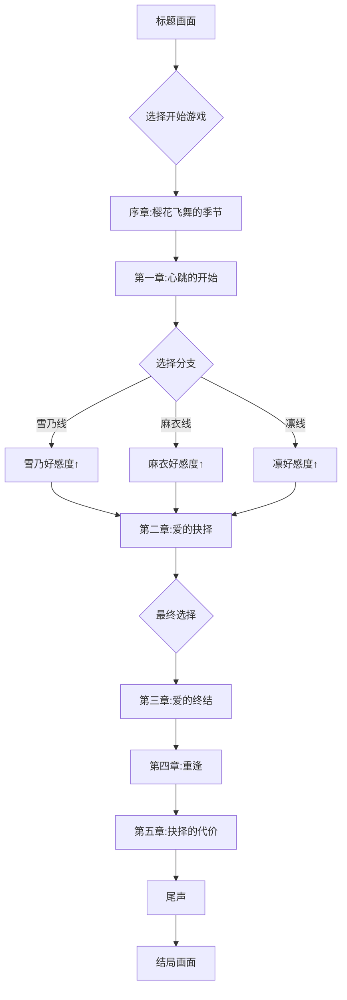

# 樱之丘学园：恋爱狂想曲 - 产品需求文档

## 1. 产品概述

一款基于网页的视觉小说（Galgame）游戏，讲述转校生佐藤悠太在樱之丘学园与三位性格迥异的女生之间展开的复杂爱情故事。游戏采用日式视觉小说风格，包含对话系统、角色立绘、场景背景、选择分支和存档功能。

## 2. 核心功能

### 2.1 用户角色
| 角色 | 说明 |
|------|------|
| 玩家 | 扮演男主角佐藤悠太，通过对话选择推进剧情 |

### 2.2 功能模块
1. **标题画面**：游戏启动界面，包含开始游戏、继续游戏、设置等选项
2. **对话系统**：角色对话展示、旁白文字、自动/手动播放模式
3. **立绘展示**：三位女主角的动态立绘（表情变化）
4. **背景系统**：不同场景的背景图片切换
5. **选择系统**：关键剧情节点的选择分支
6. **存档系统**：最多6个存档槽位
7. **设置面板**：文字速度、音量、跳过模式等
8. **回溯系统**：返回上一个选择点重新选择

## 3. 核心流程



## 4. 角色设定

### 佐藤悠太
- 身份：来自东京的转校生，一年级学生
- 性格：温柔善良但优柔寡断
- 特点：喜欢摄影

### 宫泽雪乃
- 身份：三年级学生，学生会副会长
- 性格：温柔可人，细心体贴
- 特点：擅长照顾人

### 三浦麻衣
- 身份：二年级学生，排球部主力
- 性格：活泼开朗，敢爱敢恨
- 特点：运动神经发达

### 桐山凛
- 身份：一年级学生，班长
- 性格：冷艳神秘，内心火热
- 特点：喜欢文学

## 5. UI设计

### 5.1 设计风格
- **主题**：日式视觉小说风格，樱花主题
- **主色调**：粉色系 (#FFB7C5, #FF69B4) + 白色 + 深粉色
- **字体**：思源黑体（简体中文）/ Noto Sans JP（日文备用）
- **布局**：16:9 宽屏比例，中央主体内容区

### 5.2 页面设计
| 页面 | 元素 | 描述 |
|------|------|------|
| 标题画面 | 背景、标题、菜单按钮、樱花飘落动画 | 樱花树下的学校背景 |
| 对话画面 | 角色立绘、对话框、角色名、选项 | 底部对话框 + 中央立绘 |
| 存档画面 | 6个存档槽、时间戳、缩略图 | 网格布局 |
| 设置画面 | 音量滑块、速度选择、开关选项 | 简洁列表布局 |

### 5.3 响应式设计
- 默认：1280x720 或 1920x1080
- 移动端：自适应缩放，保持16:9比例

## 6. 技术架构

### 6.1 技术栈
- 前端：React 18 + TypeScript + TailwindCSS
- 构建：Vite
- 状态管理：Zustand
- 动画：CSS Animations + Framer Motion

### 6.2 项目结构
```
src/
├── components/
│   ├── TitleScreen.tsx      # 标题画面
│   ├── GameScreen.tsx       # 游戏主画面
│   ├── DialogueBox.tsx      # 对话框组件
│   ├── CharacterSprite.tsx  # 角色立绘
│   ├── ChoiceMenu.tsx       # 选择菜单
│   ├── SaveLoadMenu.tsx     # 存档读档
│   └── SettingsMenu.tsx     # 设置面板
├── data/
│   └── story.ts             # 剧情数据
├── store/
│   └── gameStore.ts         # 游戏状态管理
├── types/
│   └── index.ts             # TypeScript类型定义
├── App.tsx
└── main.tsx
```

## 7. 剧情内容

### 7.1 章节结构
1. **序章**：樱花飞舞的季节 - 初次相遇
2. **第一章**：心跳的开始 - 情感升温
3. **第二章**：爱的抉择 - 亲密关系
4. **第三章**：爱的终结 - 做出选择
5. **第四章**：重逢 - 释怀与和解
6. **第五章**：抉择的代价 - 成长与感悟
7. **尾声**：永恒的爱情 - 婚姻与家庭

### 7.2 内容处理
- 对话内容将完整呈现原故事的精髓
- 敏感内容将进行适当文学化处理
- 保持故事的完整性和情感深度
