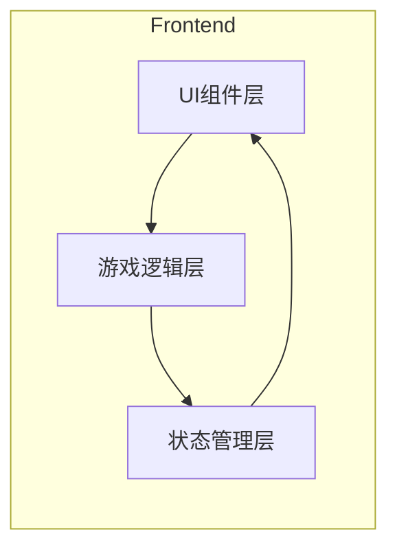

# 樱之丘学园：恋爱狂想曲 - 技术架构文档

## 1. 架构设计



## 2. 技术栈

- **前端框架**：React 18
- **语言**：TypeScript
- **样式**：TailwindCSS
- **构建工具**：Vite
- **状态管理**：Zustand
- **动画**：CSS Animations + Framer Motion
- **包管理器**：pnpm

## 3. 路由定义

| 路由 | 用途 |
|------|------|
| / | 标题画面 |
| /game | 游戏主画面 |
| /save | 存档画面 |
| /load | 读档画面 |
| /settings | 设置画面 |

## 4. 数据模型

### 4.1 游戏状态
```typescript
interface GameState {
  currentScene: string;
  currentDialogueIndex: number;
  choices: Choice[];
  characterEmotions: Record<string, string>;
  flags: Record<string, boolean>;
  settings: GameSettings;
  autoPlay: boolean;
  skipMode: boolean;
}

interface GameSettings {
  textSpeed: number;      // 1-5
  autoPlaySpeed: number;   // 毫秒
  masterVolume: number;    // 0-100
  bgmVolume: number;       // 0-100
  seVolume: number;        // 0-100
}
```

### 4.2 存档数据
```typescript
interface SaveData {
  id: number;
  timestamp: number;
  playtime: number;
  sceneName: string;
  dialogueIndex: number;
  flags: Record<string, boolean>;
  choices: Choice[];
  thumbnail?: string;
}
```

### 4.3 对话数据
```typescript
interface Dialogue {
  id: string;
  speaker: string | null;
  text: string;
  emotion?: string;
  background?: string;
  character?: string;
  position?: 'left' | 'center' | 'right';
  choices?: Choice[];
  next?: string;
}

interface Choice {
  text: string;
  next: string;
  flag?: string;
}
```

## 5. 组件结构

### 5.1 组件层级
```
App
├── TitleScreen
│   └── TitleMenu
├── GameScreen
│   ├── Background
│   ├── CharacterSprite
│   ├── DialogueBox
│   │   ├── SpeakerName
│   │   └── TextDisplay
│   └── ChoiceMenu
├── SaveLoadScreen
│   └── SaveSlot[]
├── SettingsScreen
│   └── SettingsPanel
└── BacklogModal
```

### 5.2 核心组件职责

| 组件 | 职责 |
|------|------|
| TitleScreen | 显示标题、启动菜单 |
| GameScreen | 游戏主循环、场景管理 |
| DialogueBox | 对话文本显示、打字机效果 |
| CharacterSprite | 角色立绘显示、表情切换 |
| ChoiceMenu | 选择分支UI |
| SaveLoadScreen | 存档/读档界面 |
| SettingsMenu | 设置选项UI |

## 6. 状态管理 (Zustand)

```typescript
interface GameStore {
  // 状态
  scene: string;
  dialogueIndex: number;
  history: Dialogue[];
  isAutoPlaying: boolean;
  isSkipping: boolean;
  
  // 方法
  nextDialogue: () => void;
  makeChoice: (choice: Choice) => void;
  goBack: (steps?: number) => void;
  saveGame: (slotId: number) => void;
  loadGame: (slotId: number) => void;
  updateSettings: (settings: Partial<GameSettings>) => void;
}
```

## 7. 故事数据结构

### 7.1 场景节点
每个场景由多个对话节点组成，支持分支跳转：

```typescript
const scenes: Record<string, Dialogue[]> = {
  'prologue': [
    { id: 'p1', speaker: null, text: '四月的樱之丘学园...' },
    { id: 'p2', speaker: '雪乃', text: '请问，你是佐藤悠太同学吗？', emotion: 'happy' },
    // ...
  ]
}
```

### 7.2 选择分支实现
```typescript
{
  id: 'choice1',
  speaker: null,
  text: '我应该怎么回应？',
  choices: [
    { text: '自我介绍', next: 'scene1a' },
    { text: '保持沉默', next: 'scene1b' }
  ]
}
```

## 8. 性能优化

- 组件懒加载
- 图片预加载
- 对话历史限制（最多保留100条）
- 使用 React.memo 优化重渲染
- 使用 CSS transform 进行动画

## 9. 兼容性

- 浏览器：Chrome, Firefox, Safari, Edge 最新版本
- 移动端：iOS Safari, Chrome Android
- 最低分辨率：320x568
